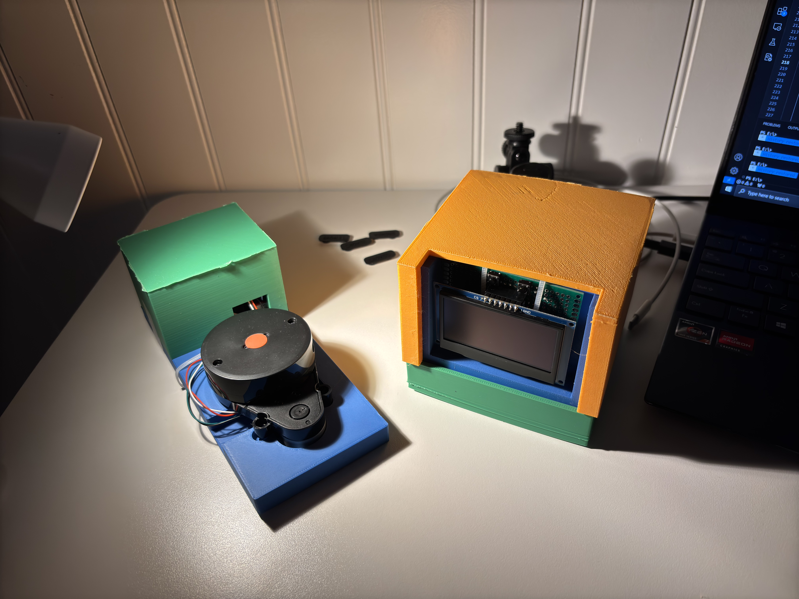

We developed a device to assist drivers with parking, specifically in compact spots. This will be done with a LiDAR sensor that will map a 2D birds eye view of obstacles in front and to the side of the car. This map will then be displayed on a screen for the driver to see and make judgements accordingly while parking. The device will assist the driver to measure the dimensions of a parking spot and help judge whether or not it is too compact to park in. 

This repository contains all the files and progression pictures/videos used to develop this product.

See our [Website](https://sites.google.com/ucsd.edu/team-12?usp=sharing) for more information

