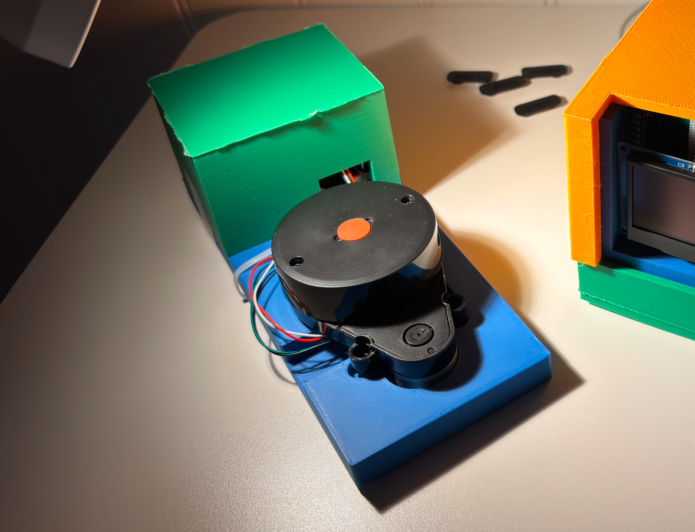
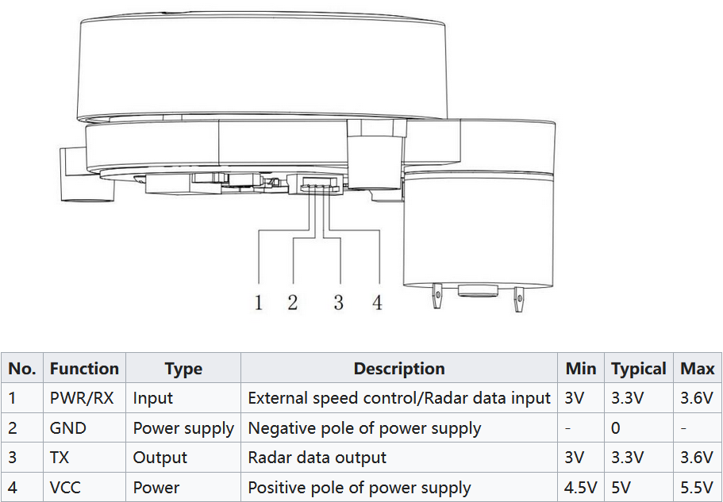
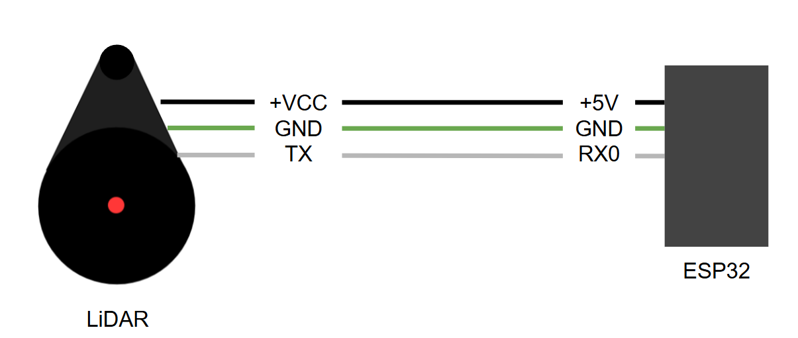
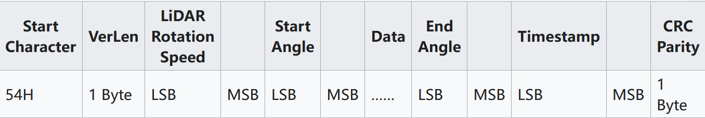
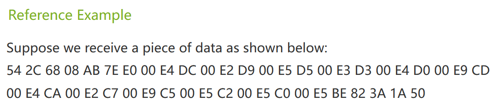
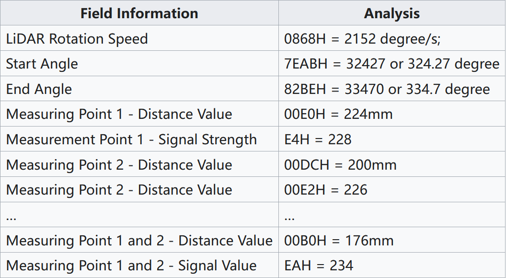

## Introduction

This tutorial will go over how to read incoming UART data from any device using CircuitPython. This is useful as a lot of devices send and receive information through this communication protocol. For the purposes of this tutorial, we will be receiving and decoding data from an [LD-14P LiDAR sensor][Lidar Link].  

### Learning Objectives

- UART Communication Protocol
- Circuit Python
- Datasheet Comprehension

## Background Information

Serial communication is a common method used in a lot of devices and electronics to send and receive information. Plenty of communication protocols exist such as I2C, SPI, and UART. Understanding serial communication, particularly UART (Universal Asynchronous Receiver-Transmitter), is essential for controlling, interfacing, and interacting with a wide range of devices, which is essential for projects that involve embedded systems. 

Pros:
- Overall simplicity
- Versatility

Cons:
- Slower speeds compared to other protocols
- Limited range as signal quality degrades over long distances

## Tools and Components Needed
- Computer or laptop that can run VSCode
- Visual Studio Code, download it [here][VSCode Link]
- Circuit Python, you can follow this instruction [here][Circuit Python Link], which is the same instruction for your VU Meter
- youyeetoo FHL-LD20 8 Meters 360 deg Lidar Sensor, you can find it [here][Lidar Link] and its datasheet [here][datasheetLink]
- ESP32 Devboard (The same one you made in class), details are found [here][devboardLink]
- USB-C cable
- Wires


## Get Started

### Serial Protocol

The UART communication protocol transmits data by sending bits one at a time, represented by high or low voltage levels, to the receiving device. Before communication begins, both devices agree on a baud rate, which determines the speed at which bits are transmitted per second.

Baudrates are going to vary widely across devices so it's important to make sure you are using the correct one. This information should always be outlined in the datasheet of the device you are working with (more on this below).

### Datasheet

Whenever working with electronic devices, it's essential to consult the accompanying datasheet, which provides detailed information on how the device works and how to configure it for your needs. The datasheet for the LiDAR sensor we're using can be found [here][datasheetLink].

In the case of the LiDAR sensor, the [datasheet][datasheetLink], when describing "transmission parameters," specifies a baud rate of 230400, meaning that 230,400 bits are transmitted per second.

### LiDAR Sensor

Since we're using a LiDAR sensor in this example, it's important to understand how it works. LiDAR operates by emitting a laser beam, which is invisible to the naked eye, towards nearby objects. The light reflects off these objects and is then received back by the LiDAR sensor. By knowing the speed of light and measuring the time it takes for the laser to travel to the object and return, the sensor can accurately calculate the distance to nearby objects. This distance data is then processed and continuously transmitted via the TX line as UART data.

This operation happens several thousands of times per second all while the internal sensors themselves are rotating in circles. This allows for a 2D top down mapping of all nearby objects

### ESP32

We will be using the [ESP32 devboard][devboardLink] you should have already made in class. This will be the microcontoller used to receive and process the UART data that's emitting from the LiDAR sensor.

### CircuitPython

I assume you have built the VU Meter using Circuit Python as [this instruction][Circuit Python Link], so you should have it installed and set up for the devboard you built earlier in class.

We will be using CircuitPython with this specific ESP32 chip as the preinstalled libraries are able to handle higher baudrates.

## Part 1: Wiring

### Introduction

We are first going to wire the LiDAR sensor to the devboard to interface with it.

### Objective

- Understanding the physical hardware of the sensor
- Learn how to read and comprehend information from a datasheet

### Background Information

The LiDAR sensor has four wires, each serving a different purpose. The datasheet specifies which wire corresponds to which function, and includes the following diagram for reference:



Because we are only interested in receiving UART data, further reading into the datasheet reveals that we can safely ignore the "PWR/RX" pin as there will be no need to send information to the sensor. We only care about pins 2, 3, and 4.

### Components

- LiDAR sensor
- 3 Wires
- Devboard

### Instructional

All the pins coming out of the sensor are going to be directly wired to the devboard. Referring back to the pinout image above, we need to power the VCC pin with 5V, tie the GND pin to the same ground as the devboard, and **connect the TX pin of the sensor to the RX0 of the devboard**. This wire will contain all the crucial data that will be read by the ESP32



## Part 2: Code

### Introduction

We are now going to write code to interface with the LiDAR sensor in CircuitPython

### Objective

- Understand how to interface with UART data in CircuitPython
- Learn how to read and comprehend information from a datasheet

### Background Information

This section assumes you have a basic understanding of python syntax and that CircuitPython is already installed on your devboard.

### Components

- Devboard
- USB-C cable
- Computer/Laptop

### Instructional

Import the following libraries to interact with the devboard
```python
import board
import busio
```

Create a UART instance from the `busio.UART` class. Assign `baudrate` to 230400
```python
uart = busio.UART(board.TX, board.RX, baudrate=230400, timeout=0.1)
```

Print the incoming data coming from the UART instance. 
```python
while True:
    if uart.in_waiting > 0:
        data = uart.read()
        print(f"Received data: {data}")
```

This piece of code waits for data to be sent to the `RX0` pin and prints it to the console.

The LiDAR should be spinning and transmitting data automatically when powered. You should see something as such:
```
Received data: b'\x54'
Received data: b'\x2C'
Received data: b'\x68'
Received data: b'\x08'
.
.
.
```
We are now successfully receiving the UART LiDAR sensor data in [hexadecimal format][hexWiki]. To understand what any of it means, we have to yet again refer back to the datasheet. 

They specify the data structure of the packet they are sending out under "Data Packet Format"

Information on what MSB and LSB mean can be found [here][MLSB]

They also provide an example output and the corresponding decoded information:



## Example

### Introduction

We have successfully grabbed the UART data that was being transmitted by a sensor. Now we can convert the raw bytes that are being received to readable information of what the LiDAR is seeing.

### Example
The datasheet specifies that each set (or "packet") of data contains 47 bytes which all start with `0x54` indicating the beginning of the packet. We can first create a list that will hold all the information each packet contains
```python
packet_size = 47
packet = []
```

Now we want to take each byte we're receiving and place it into the list
```python
while True:
    if uart.in_waiting > 0:
        data = uart.read(uart.in_waiting)
        packet.extend(data)
```

We now implement another `while` loop which is responsible for processing the incoming data once we have enough bytes to form a full packet (in this case, 47 bytes).
```python
        while len(packet) >= packet_size:
            current_packet = packet[:packet_size]
            packet = packet[packet_size:]
```
The code slices the first 47 bytes from the `packet` list and stores them in `current_packet`. `current_packet` now holds one full packet that we will process. 

After extracting the first 47 bytes into `current_packet`, we update the `packet` list to remove those 47 bytes

This ensures that the remaining data in the `packet` list, if any, stays for the next loop cycle to be processed later.


Now we essentially "shift" what 47 bytes is contained in `current_packet` until the first byte is the start byte `0x54`
```python
            if current_packet[0] == 0x54:
                .
                .
                .
                # packet operations here

            else:
                packet = packet[1:]
```
Inside the conditional is code that executes with the guarantee that `current_packet` is a properly formatted data packet transmitted from the LiDAR

Refering back to this image:

We now know what information is contained in each index

We can do some basic print statements to verify that our code works as intended and that we're receiving the information correctly
```python
            if current_packet[0] == 0x54:
                for byte in current_packet:
                    print(f"{byte:02X}", end=" ")
                print()
            else:
                packet = packet[1:]
```

This is what was printed running the code above. Notice how similar it looks to the example given in the datasheet:
```
54 2C 74 08 B0 86 00 00 D4 00 00 D4 00 00 D4 00 00 D4 00 00 D4 00 00 D5 00 00 D5 00 00 49 00 00 5F 00 00 B0 00 00 D2 00 00 D4 02 89 1E 09 1F
54 2C 68 08 AB 7E E0 00 E4 DC 00 E2 D9 00 E5 D5 00 E3 D3 00 E4 D0 00 E9 CD 00 E4 CA 00 E2 C7 00 E9 C5 00 E5 C2 00 E5 C0 00 E5 BE 82 3A 1A 50
.
.
.
```

Given that we know each index's and the information it contains, here is an example function that prints legible information coming from the sensor:
```python
            if current_packet[0] == 0x54:
                print("radar speed:", end = " ")
                print(curPack[3]*256 + curPack[2])

                print("start angle:", end = " ")
                print(curPack[5]*256 + curPack[4])
                print("end angle:  ", end = " ")
                print(curPack[43]*256 + curPack[42])

                print("time:", end = " ")
                print(curPack[45]*256 + curPack[44])
            else:
                packet = packet[1:]
```


### Analysis

Explain how the example used your tutorial topic. Give in-depth analysis of each part and show your understanding of the tutorial topic

This example demonstrates how to decode each UART packet coming from a LiDAR sensor and, with the datasheet in hand, we can convert the bytes into legible information useful for interpreting the sensor's measurements. Using the data coming into the RX0 pin and knowing how it's formatted, we can extract meaningful data such as radar speed, angles, and other environmental details.

## Additional Resources

### Useful links

[Bit Significance][MLSB]

[Hexadecimal][hexWiki]

[LiDAR Sensor][Lidar Link]

[LiDAR Datasheet][datasheetLink]


[Lidar Link]: https://www.amazon.com/youyeetoo-FHL-LD20-Raspberry-Triangulated-Start-Stop/dp/B0C3CX17FN
[ESP32 Link]: https://www.amazon.com/dp/B08D5ZD528?ref=ppx_yo2ov_dt_b_fed_asin_title&th=1
[Screen Link]: https://www.amazon.com/dp/B0D7HN3XQ5?ref=ppx_yo2ov_dt_b_fed_asin_title
[Suction Cup Link]: https://www.amazon.com/ThtRht-Suction-Windshield-Camcorder-Recorder/dp/B0CPLV4B9F
[ESP-NOW Link]: https://www.espressif.com/en/solutions/low-power-solutions/esp-now
[Arduino IDE Link]: https://www.arduino.cc/en/software
[VSCode Link]: https://code.visualstudio.com/
[Circuit Python Link]: https://ece-196.github.io/docs/assignments/vu-meter/firmware/
[OLED Screen Link]: https://www.amazon.com/Teyleten-Robot-Display-SSD1309-Interface/dp/B09LND6QJ1?crid=2NS440QNA8L2N&dib=eyJ2IjoiMSJ9.l7V7zqGnfz5tpb12Y4vhPfd6kcDo9Gy_9YxzPdgyHeA-stbcUC53jzvRBqjo9Q9JBe1BkHeOFJ04y90IgaGZ3agsD5l1un_QmPUPOsPJj8ZE-nJoF3GeJ2r58FPdj7uPpWhgW64wHKHulnyFKdYspzRMkfGyqlLCzbuZkltIeoFwT9sNAwJNMJET8-38BXq6n1nJkHzrwQzCMwJJcBCXR966NtDY9C7Sn5hIxQ45Z1M.BqTYKnKZpQOdVkGlEjtYdvPTKl41DxKrgW7eLwadZLw&dib_tag=se&keywords=2.42+inch+display&qid=1731571123&sprefix=2.42+inch+displa%2Caps%2C156&sr=8-1#cr-media-gallery-popover_1732676448576
[Library Link]: https://circuitpython.org/libraries
[SPI Wiki Link]: https://en.wikipedia.org/wiki/Serial_Peripheral_Interface
[datasheetLink]: https://www.waveshare.com/wiki/D200_LiDAR_Kit
[devboardLink]: https://ece-196.github.io/docs/assignments/dev-board/
[hexWiki]: https://en.wikipedia.org/wiki/Hexadecimal
[MLSB]: https://en.wikipedia.org/wiki/Bit_numbering